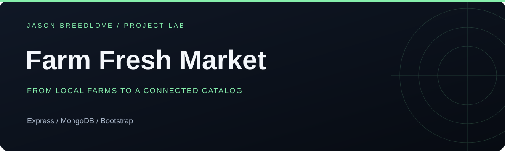

[Open live app](https://farmfresh.jasonbreedlove.dev) · [Portfolio](https://www.jasonbreedlove.dev) · [Browse source](https://github.com/Breedlove-Jason/farm-fresh-market)

# Farm Fresh Market

Jason Breedlove's farm-to-market catalog, built with Express, EJS, MongoDB/Mongoose, and Bootstrap (Bootswatch Lux). Browse farms and products, search the catalog, filter categories, and manage farm/product relationships through protected owner tools.

This is a portfolio catalog demo, not a checkout or payment system. Sample farms are fictional.

## Local setup

Use Node.js 24. Run `npm ci`, copy `.env.example` to `.env`, and set `MONGODB_URI` to a dedicated market database. Run `npm start` and open http://localhost:3000.

Set `MARKET_ADMIN_PASSWORD` to a unique password of at least 24 characters to enable editing. The browser sign-in username is `owner`. Without that variable, public browsing works but editing is disabled. Use HTTPS for hosted deployments. Credentials are never exposed in templates or client JavaScript.

## Vercel deployment

1. Import `Breedlove-Jason/farm-fresh-market`. Choose **Express**, root directory `./`, default install command, no build command or output-directory override.
2. Add `MONGODB_URI` and `MARKET_ADMIN_PASSWORD` as sensitive environment variables for the intended deployment environment. Use a dedicated MongoDB database, not YelpCamp's database. Preview and Production should use separate databases if you will test edits in Preview.
3. Deploy `master` (the completed launch work is merged). The app exports Express, waits for a reusable MongoDB connection, and includes its EJS templates.
4. Check the home, farms, products, filters, owner sign-in, product creation/edit/delete, and farm deletion using disposable test records. No real database writes have been verified by the local test suite.
5. Keep `master` as the Production branch. In project **Domains → Add Existing**, connect `farmfresh.jasonbreedlove.dev` to Production.

Reference: [Express on Vercel](https://vercel.com/docs/frameworks/backend/express).

## Sample data

`npm run seed` adds four fictional farms and twelve products **only to an empty database**. It refuses an existing catalog and never clears data. Seeding is manual; deployments never seed automatically. If a seed is interrupted, inspect the partial records before retrying; the command does not automatically roll back or overwrite them.

## Validation

`npm test` exercises HTTP behavior, write protection, cross-origin rejection, standalone product rendering, field allowlists, farm-scoped deletion, JavaScript serialization, model validation, and safe seed refusal. Database operations are mocked; real MongoDB connectivity and persistence must be checked in the deployment.

## Implementation notes

- Homepage and static files work independently of MongoDB; catalog routes return a friendly 503 if the database is unavailable.
- A cached connection promise avoids competing cold-start connections and retries after failed attempts.
- Owner editing uses HTTP Basic authentication and same-origin form checks. This is a single-owner portfolio editor, not multi-user account management. Consider managed authentication and rate limiting before expanding access.
- Farm/product links are maintained by application writes. Multi-document writes are not transactional; production commerce would require transactions and recovery for partial failures.
- The seed command preserves existing records; no live database has been seeded or modified during this upgrade.
